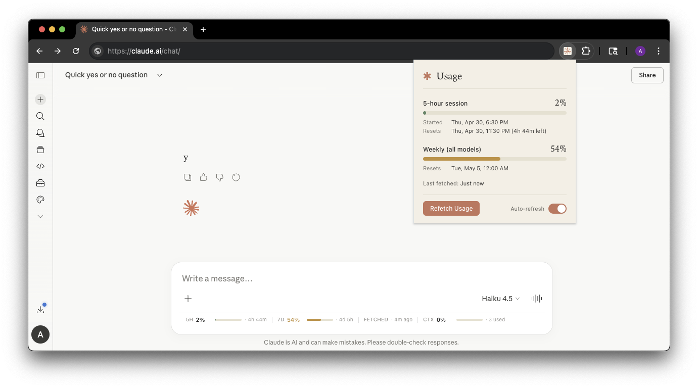

# Claude Usage Tracker

A Chrome extension that monitors your Claude.ai usage in real-time. It injects a compact usage bar directly into the Claude.ai chat interface and provides a popup dashboard with more detail.



## Features

- **Inline chat bar** — usage stats visible directly below the chat input on claude.ai
- **Popup dashboard** — click the extension icon for a fuller view with timestamps
- **Context token counter** — tracks how much of the 200k context window the current conversation is using
- **Auto-refresh** — automatically resets your 5-hour usage window when it expires (see below)
- **Incognito support** — regular and incognito windows are tracked separately (useful if you use two accounts)

## What gets tracked

Three Claude usage limits are displayed:

| Label | What it measures |
|---|---|
| **5h** | Your 5-hour rolling session usage |
| **7d** | Weekly usage across all models |
| **Ctx** | Current conversation context tokens (out of 200k) |

Each shows a percentage, a mini progress bar, and time until reset. Colors shift from green → amber (50%+) → red (80%+).

## Installation

1. Download or clone this repository
2. Go to `chrome://extensions/` in Chrome
3. Enable **Developer mode** (top-right toggle)
4. Click **Load unpacked** and select the repository folder
5. Visit https://claude.ai — the usage bar will appear below the chat input

## How the inline bar works

The bar is injected by `content.js` directly into the claude.ai page. It makes its own API calls to Claude's usage endpoint — independently of the popup.

**Fetch behavior:**
- Fetches immediately when the page loads (if the tab is in the foreground)
- Fetches every **15 seconds** while the tab is active and visible
- Stops fetching entirely when you switch to another tab or minimize the browser
- Resumes immediately (with a fresh fetch) when you come back to the tab
- Force-fetches after every prompt response completes

The "Fetched" timestamp in the bar reflects when the bar itself last successfully fetched — not when the popup last fetched.

## How the popup works

The popup is driven by `popup.js` and `background.js`. It does not share fetch results with the inline bar — they fetch independently.

- **On open:** if a claude.ai tab exists, automatically fetches fresh usage via the background service worker
- **Refetch Usage button:** manually triggers a fresh fetch
- The background worker executes the API calls inside an existing Claude tab (or opens a temporary one if none is open), then saves the result to `chrome.storage.local`
- The "Last fetched" timestamp in the popup reflects when the popup or background worker last fetched, not the inline bar

## How auto-refresh works

The auto-refresh toggle is **not** about refreshing the usage display. It solves a different problem: when your 5-hour usage window expires, you normally have to wait for it to reset before sending more messages. Auto-refresh resets it automatically.

**What it does:**
1. A background alarm fires every **5 minutes**
2. It reads the stored `resets_at` timestamp from the last known usage data
3. If the window has not expired — does nothing
4. If the window has expired — sends a short throwaway prompt (`"Ans y/n, k?"` to claude-haiku-4-5) via the API, which consumes a tiny amount of quota and resets the 5-hour window to start fresh
5. If the window is still expired after that prompt — retries on the next alarm tick
6. After **30 failed retries** the toggle turns itself off automatically

**Requirements:**
- At least one claude.ai tab must be open in the same window context (regular or incognito)
- If no tab is open, the background worker opens a temporary one, waits for it to load, then closes it after the API call

The alarm period is 5 minutes, so there can be up to a 5-minute delay between window expiry and the first reset attempt.

## Data independence

The inline bar and the popup fetch usage data independently. Opening the popup does not update the bar, and the bar's 15-second fetches do not update the popup. The only state they share is the auto-refresh toggle (stored in `chrome.storage.sync`).

## Incognito support

Claude treats regular and incognito browser windows as separate sessions (different cookies, potentially different accounts). The extension tracks them independently using separate storage keys. The popup detects which window type it's open in and shows the correct data.

## Permissions

| Permission | Why it's needed |
|---|---|
| `storage` | Saves usage data and toggle state locally |
| `scripting` | Injects the inline bar into claude.ai and executes API calls inside tabs |
| `tabs` | Finds existing claude.ai tabs for auto-refresh and popup fetches |
| `alarms` | Schedules the 5-minute auto-refresh check |
| `https://claude.ai/*` | Accesses Claude's usage API endpoints |

## Privacy

- No external servers — all traffic is between your browser and claude.ai
- No analytics or tracking
- Uses your existing browser session (no credentials are stored or transmitted elsewhere)
- Open source — every line is auditable

## File structure

```
├── manifest.json    — extension manifest (MV3)
├── background.js    — service worker: auto-refresh alarm, popup fetch handler
├── content.js       — injected into claude.ai: inline bar, visibility-driven polling
├── popup.html       — popup markup
├── popup.js         — popup logic and rendering
├── popup.css        — popup styles
└── icons/           — 16, 32, 48, 128px PNGs
```

## Troubleshooting

**Bar doesn't appear:**
- Make sure you're on https://claude.ai (not claude.com)
- Make sure you're signed in
- Reload the extension from `chrome://extensions/`

**Usage shows "—" or never updates:**
- Click "Refetch Usage" in the popup once to seed the data
- If that fails, check you're signed into claude.ai

**Auto-refresh turned itself off:**
- It exhausted 30 retry attempts (2.5 hours of trying) without successfully resetting the window
- Toggle it back on manually — it will start checking again on the next 5-minute alarm

**Different numbers in the bar vs the popup:**
- Expected — they fetch independently and at different times

**Incognito usage not showing:**
- Open the popup while the incognito window is focused
- Make sure a claude.ai tab is open in that incognito window

## License

MIT — use freely, modify, distribute

## Inspiration

Inspired by [claude-counter](https://github.com/she-llac/claude-counter). Not affiliated with Anthropic.
